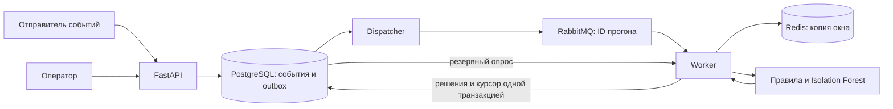

# Устройство SignalWatch

## Приём и порядок

API блокирует строку `catalog_state`, нормализует события и сравнивает SHA-256 тела при повторе UUID. Новые события получают последовательные номера. В той же транзакции появляется запись outbox. Конфликт в любом месте пачки откатывает всю пачку.

Строка состояния нужна для порядка commit: после события N не появится ещё не завершившаяся транзакция с меньшим номером. Worker обрабатывает номера последовательно. Это ограничивает масштаб записи, зато делает поведение воспроизводимым.

## Доставка уведомлений

Dispatcher выбирает outbox через `FOR UPDATE SKIP LOCKED`, отправляет постоянное сообщение с publisher confirm и только затем отмечает строку опубликованной. Падение после подтверждения брокера, но до commit, приводит к повторной отправке.

Сообщение содержит ID прогона. События и прогресс остаются в PostgreSQL. Worker подтверждает сообщение после обработки доступной части журнала. Некорректные сообщения уходят в `signalwatch.dead`. Резервный опрос незавершённых прогонов закрывает потерю уведомлений и недоступность брокера.

Publisher confirm подтверждает приём брокером, consumer acknowledgement — завершение обработки потребителем. Они не устраняют возможность повторной доставки. [Документация RabbitMQ](https://www.rabbitmq.com/docs/confirms).

## Временные окна

Для события используются только ранее обработанные события в интервале `(t − window, t]`. Текущее событие включается один раз. Окна — 60 и 300 секунд. Пользовательские признаки и признаки IP считаются отдельно: один IP может принадлежать нескольким пользователям.

В прогоне хранится watermark — наибольшее время обработанного события. Событие старше `watermark − 30` получает статус `late` и не меняет признаки следующих событий. Сама граница допускается. Для допустимого опоздания история хранит 330 секунд относительно watermark.

Небольшое опоздание влияет на своё и последующие решения; прежние решения не пересчитываются. Поэтому replay сохраняет порядок приёма, а не сортирует весь журнал по времени события.

## Worker и Redis

Транзакционная advisory-блокировка PostgreSQL не позволяет двум обработчикам одновременно менять один прогон. В одной транзакции сохраняются решения пачки, watermark и курсор. Падение до commit откатывает их вместе.

Redis хранит копию окна с курсором, версией модели и контрольной суммой. Копия принимается только при точном совпадении курсора и версии; тело проверяется входной схемой. При отсутствии, порче или недоступности кеша окно восстанавливается из событий, по которым уже сохранены решения `scored`.

Кеш записывается после commit PostgreSQL. Поздняя запись с меньшим курсором отклоняется Lua-скриптом. Падение между commit и записью кеша приводит к восстановлению окна из БД на следующем шаге.

## Детектор и неизменяемые решения

Manifest содержит SHA-256 модели, пороги, порядок признаков, параметры окон, версии библиотек и распределения train для PSI. По manifest считается identity; прогон связан с этим значением. Другая модель или другой порог не могут незаметно продолжить прежний прогон.

Isolation Forest обучается на раннем нормальном периоде. Используется отрицательное `score_samples`: большее число означает более необычное сочетание признаков, а не вероятность атаки. [Документация scikit-learn](https://scikit-learn.org/stable/modules/generated/sklearn.ensemble.IsolationForest.html).

Решения содержат признаки, обе оценки и оба порога, выбранный способ формирования тревог и версию артефакта. Ручная проверка дописывает отдельную историю с контролем версии. Вердикты оператора не переобучают модель автоматически.

## Повторный прогон

Replay фиксирует верхний номер события и начинает с нулевого курсора. Его кеш отделён от live. Digest включает номер события, статус, признаки, результат и тревогу. ID прогона и длительность вычисления исключены. Для совпадения нужны одинаковые события, порядок и версия детектора.

## Пределы реализации

Окно хранится как история событий, ограниченная по времени. При большом потоке за пять минут стоимость расчёта и восстановления растёт. Один прогон выполняет шаги последовательно. Нет шардирования, автоматического архивирования и миграции работающего потока на новую модель.

Триггеры запрещают обычные UPDATE/DELETE журналов. Локальный пользователь PostgreSQL имеет административные права: это защита от ошибок приложения, а не от администратора БД.
